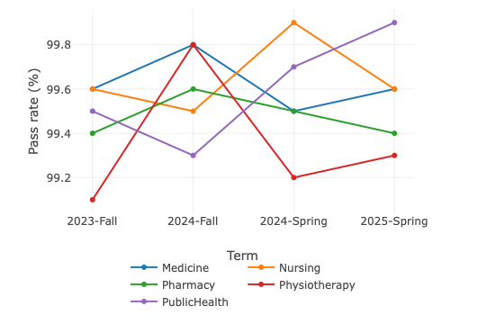
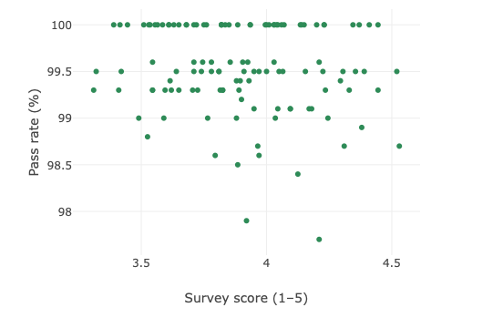

# Quality Enhancement Analytics
# Quality Enhancement Analytics

[](https://doi.org/10.5281/zenodo.16937642)
[](LICENSE)
[](https://hellosultan.github.io/quality-enhancement-analytics/)

📊 End-to-end analytics project using synthetic higher-ed datasets aligned with QAA UK themes (Assessment, Engagement, Monitoring).

## 📸 Dashboard Preview
Here are a few highlights from the interactive dashboard:

<table>
<tr>
<td align="center" width="50%">
  
**1. Programme pass rates by term**  


</td>
<td align="center" width="50%">

**2. At-risk modules (satisfaction vs pass)**  


</td>
</tr>
</table>

👉 [View the full interactive dashboard](https://hellosultan.github.io/quality-enhancement-analytics/)

---

## Quick Setup (Local)

```bash
conda create -n qe python=3.11 -y
conda activate qe
pip install -r requirements.txt
python src/sql/load_qe_data.py    # build synthetic SQLite DB + CSVs
python src/app/build_static_dashboard.py   # generate static dashboard

**End-to-end analytics project for Quality Enhancement (QE) in Higher Education**, using **synthetic datasets** aligned with **QAA UK** themes.  
Showcases skills across **data generation → cleaning → KPI analysis → visualization/dashboard**.

---

## ✨ What’s inside

- **Synthetic data builder** (SQLite) for students, assessments, surveys, support usage, etc.  
- **Notebook analysis** for cleaning, features (turnaround bins, engagement index), and KPIs.  
- **Exports**: tidy **CSVs** and **PNGs** ready for dashboards (Power BI or Python).  

---

## 📁 Repository structure

```text
quality-enhancement-analytics/
├─ notebooks/
│  └─ analysis.ipynb          # cleaning, features, KPIs, plots
├─ src/
│  └─ sql/
│     └─ load_qe_data.py      # synthetic dataset builder → data/qe.db
├─ data/                      # SQLite DB (generated; ignored by git)
│  └─ qe.db
├─ reports/
│  └─ figures/                # exported CSVs/PNGs for dashboards
├─ requirements.txt
└─ .gitignore
🚀 Quick start (Python 3.11 via Conda)
# Create & activate env
conda create -n qe python=3.11 -y
conda activate qe

# Install deps
pip install -r requirements.txt

# Build the synthetic SQLite DB
python src/sql/load_qe_data.py

# (Optional) Register Jupyter kernel
python -m ipykernel install --user --name qe --display-name "qe (Py3.11)"

# Launch Jupyter and open notebooks/analysis.ipynb
jupyter notebook
# If Jupyter isn’t on PATH:
python -m notebook

⸻

🧪 Data & features (high level)
	•	Tables:
students, admissions, modules, enrolments, assessments, grades,
surveys (QAA-theme items), support_usage, complaints, placements.
	•	Features:
	•	Assessment turnaround (days) + bins: <=10, 11–15, 16–20, >20
	•	Programme/term pass rate (avg ≥ 50% pass)
	•	Engagement index = survey mean (1–5) × log(1 + median support visits)
	•	At-risk modules = pass rate < 70% and survey < 3.5

⸻

📊 Outputs (saved to reports/figures/)

CSVs
	•	kpi_pass_rate.csv
	•	assessment_turnaround_bins.csv
	•	engagement_index.csv
	•	at_risk_modules.csv

PNGs
	•	pass_rate_trend_<Programme>.png
	•	turnaround_distribution.png
	•	scatter_pass_vs_survey.png
	•	scatter_engagement_vs_pass.png

⸻

🧭 QAA alignment (examples)
	•	Assessment → turnaround timeliness, grade distributions, pass rates
	•	Monitoring & Evaluation → programme trends, at-risk detection
	•	Student Engagement / Enabling Achievement → survey means, engagement index
	•	Admissions/Widening Participation → offer rates, WP flags (extendable)

⸻

🗺️ Roadmap
	•	One-page Python “mini dashboard” that loads exported CSVs
	•	Power BI dashboard (Admissions, Assessment, Engagement, Monitoring tabs)
	•	Extend synthetic data to include employability/outcomes KPIs

⸻

🤝 Notes
	•	All data are synthetic (RNG-seeded) and safe for public repos.
	•	Designed for lightweight analytics using pandas + SQLite (scale up to Spark only if needed).

⸻
